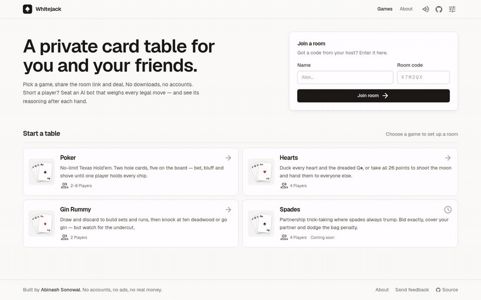
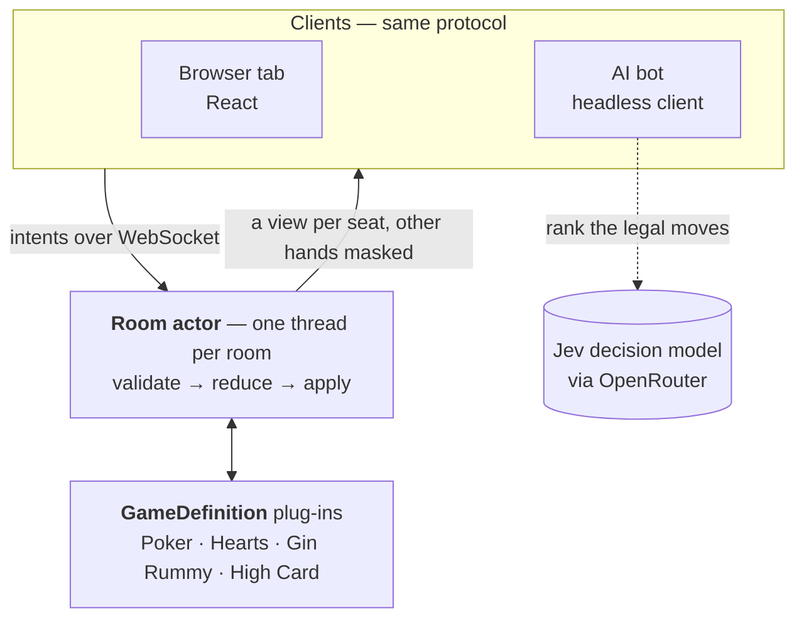
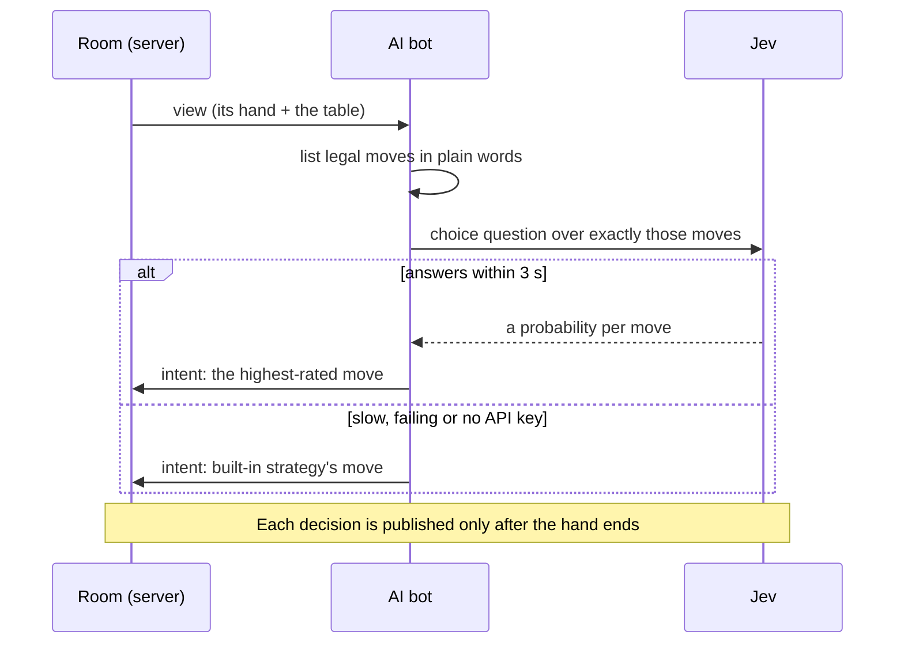
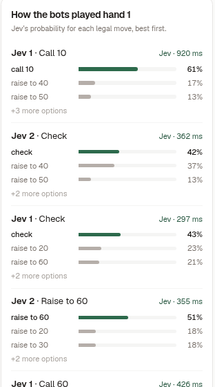

# Whitejack

Private multiplayer card tables in the browser — Poker, Hearts and Gin Rummy — with AI bots that
fill empty seats and show their reasoning after every hand. No accounts, no downloads.

**[Play it at whitejack.games](https://whitejack.games/)** · [How it works](https://whitejack.games/#/about) · [Architecture notes](docs/architecture.md)

[](https://github.com/abinashrasonowal/whitejack/actions/workflows/ci.yml)
[](LICENSE)




## Why it's interesting

- **Server-authoritative engine.** Each room is a single-threaded actor that owns the game state.
  Clients only send intents and get back a view filtered for them, so hidden cards never leave the server.
- **Games are plug-ins.** A game implements one `GameDefinition` contract and is discovered at
  runtime. The engine compiles with no game on its classpath.
- **AI bots that can't cheat or stall.** A bot is an ordinary socket client. It asks an LLM decision
  model ([Jev](https://openrouter.ai/~typesafe/jev-latest)) to rank exactly the legal moves, falls back
  to a built-in strategy after 3 s, and its reasoning is published only once the hand is over.
- **Verifiable shuffles.** Each hand's seed is committed before the deal and revealed after it, and every
  player's client seed is mixed in, so the server can't choose the deck on its own.

## Games

| Game | Players | Rules in one line |
| --- | --- | --- |
| **Poker** | 2–8 | No-limit Texas Hold'em freezeout: 1,000 chips each, blinds 10/20 doubling every 10 hands, side pots for all-ins. |
| **Hearts** | 4 | Pass three cards, then duck every heart and the Q♠, or take all 26 points to shoot the moon. First to 100 ends it. |
| **Gin Rummy** | 2 | Build sets and runs, then knock at 10 deadwood or go gin; watch for the undercut. First to 100 wins. |

Every rule is enforced on the server. Short a player? The host adds AI bots from the waiting room.

## Architecture



Clients never decide legality: they send an intent, the room actor validates it against the game,
applies the resulting events, and sends each seat a view with everyone else's cards removed.

### One bot turn



A bot's options are its own cards, so each move it makes is recorded and served from
`GET /api/rooms/{room}/bot-notes` only after that hand is over. The table shows it as the panel below.

<p align="center">
  
  <br><sub>The table's "How the bots played" panel after a hand of Poker.</sub>
</p>

## Quick start

```sh
docker compose up --build                     # → http://localhost:8080
```

Without Docker (Java 17 and Node 22):

```sh
./gradlew :whitejack-server:bootRun           # builds the UI too; http://localhost:8080
./gradlew :whitejack-server:bootRun -PskipUi  # API only, alongside `npm run dev` in whitejack-ui
```

For model-backed bots, put `OPENROUTER_API_KEY=…` in `.env` (see `.env.template`). Without a key,
bots still play using their built-in strategy.

<details>
<summary><b>Configuration</b></summary>

| Variable | Purpose |
| --- | --- |
| `WHITEJACK_COOKIESECRET` | Signs the player identity cookie. Set it, or every restart gives players new identities and a warning is logged. With Compose, export `WHITEJACK_COOKIE_SECRET` instead. |
| `WHITEJACK_ALLOWEDORIGINS` | Extra origins allowed to open the WebSocket (same-origin always works). Default `http://localhost:*`. |
| `WHITEJACK_BOTS_OPENROUTERAPIKEY` | OpenRouter API key for the bots' model. Unset, bots still play legal heuristic moves. With Compose, export `OPENROUTER_API_KEY` instead. |
| `WHITEJACK_BOTS_MODEL` | Decision model the bots consult (default `~typesafe/jev-latest`, TypeSafe's Jev). |
| `WHITEJACK_BOTS_ENDPOINT` | Decisions endpoint (default OpenRouter's `https://openrouter.ai/api/alpha/decisions`; TypeSafe's own `https://api.typesafe.ai/v1/systemone` with model `jev-latest` also works). |
| `WHITEJACK_BOTS_ENABLED` | `false` turns off `POST /api/rooms/{room}/bots` (default `true`). |
| `WHITEJACK_BOTS_TIMEOUT` | How long a bot waits for the model before playing its heuristic move (default `3s`). |
| `WHITEJACK_BOTS_MAXPERROOM` | Most bots one room may seat (default `7`). |
| `WHITEJACK_BOTS_PACE` | Least time between a bot seeing a view and acting on it, so people can follow (default `700ms`). |
| `WHITEJACK_PORT` | Compose only: host port to publish (default `8080`). |

Rooms are held in memory, so run **one** container: a restart ends games in progress, and a
second replica would not see the first one's rooms.

</details>

## Project layout

| Module | What it is |
| --- | --- |
| [`engine-contract`](engine-contract) | The `GameDefinition` interface and the shared types every game and the engine speak. |
| [`engine-core`](engine-core) | Room actor, game session, room registry, and seeded commit–reveal dealing. Knows no game. |
| [`games/*`](games) | Poker, Hearts, Gin Rummy and High Card, each its own module loaded at runtime. |
| [`whitejack-bots`](whitejack-bots) | The headless bot client, one strategy per game, and the Jev advisor. |
| [`whitejack-server`](whitejack-server) | Spring Boot app: REST API, WebSocket gateway, bot service. Serves the built UI. |
| [`whitejack-ui`](whitejack-ui) | React 19 + TypeScript + Tailwind CSS client. |

## Testing

```sh
./gradlew build      # 169 tests across all modules, plus the UI type-check and build
```

- **Game rules and redaction:** per-game suites check that legal play works, illegal play is
  refused, and no view carries another player's cards.
- **Engine:** room-actor behaviour (hosting, reconnects, seat holds), sessions, and the fairness
  of seeded shuffles.
- **End to end:** real socket clients play hands against the running server, and bots finish
  Hearts, Gin Rummy and High Card hands with a person.
- **Bot reasoning:** notes for the hand in play are never served, and served notes never include a
  bot's private description of its hand.

CI runs the same build on every push ([`.github/workflows/ci.yml`](.github/workflows/ci.yml)).

---

Built by [Abinash Sonowal](https://github.com/abinashrasonowal). Feedback and ideas are welcome:
[abinashrasonowal@gmail.com](mailto:abinashrasonowal@gmail.com) or [open an issue](https://github.com/abinashrasonowal/whitejack/issues).
Licensed under [MIT](LICENSE).
